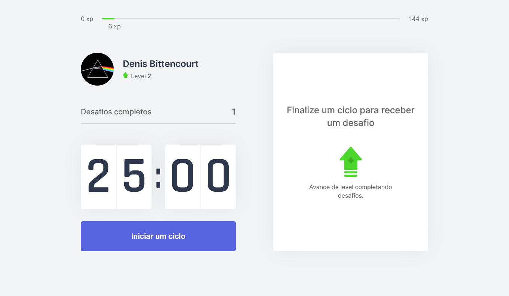
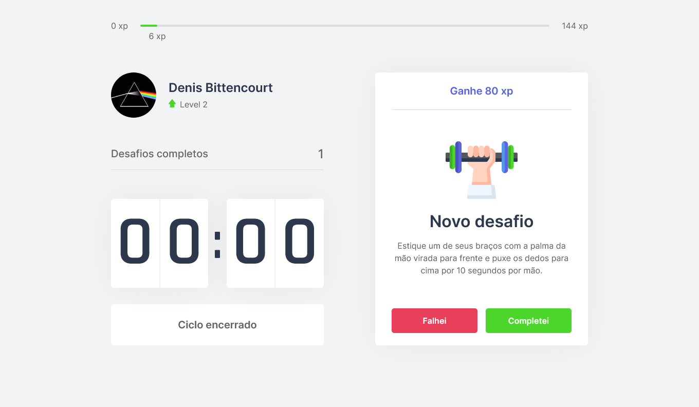
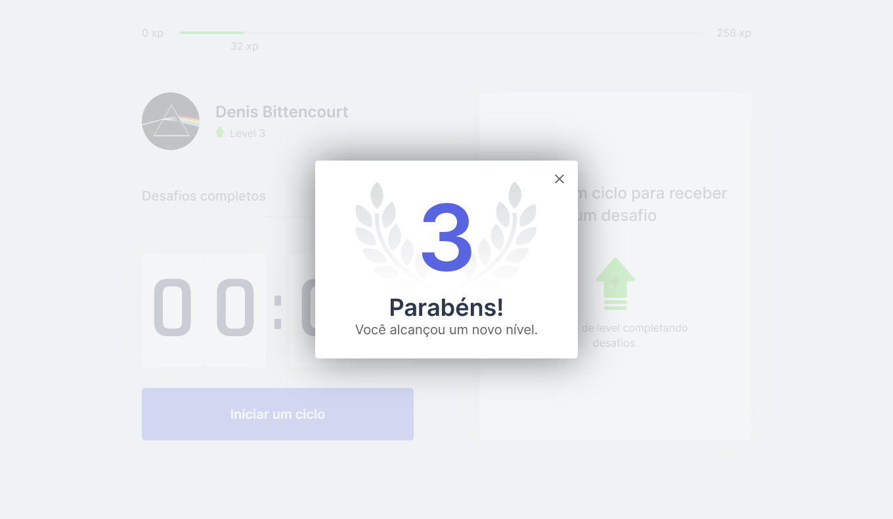

# MoveIt

This project was made during the Next Level Week #4 bootcamp provided by RocketSeat.

## Technologies

- ReactJS
- NextJS
- Typescript
- HTML
- CSS

## Home

    

## Novo desafio

    

## Level Up

    

## Getting Started

- First clone the repository to your local computer
- Navigate to the project folder
- And run the development server:

'''
    yarn dev
'''